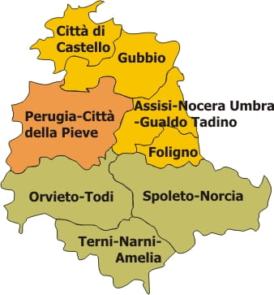

# Dioceses of Umbria

In Umbria, most parish registers were transferred to municipalities together with civil status registers and are kept there today.

However, diocesan archives and parishes may still hold residual material.

## Diocese Pages

The *Regione ecclesiastica Umbria* now includes **eight dioceses**, which cover almost the same territory as the modern civil region of Umbria.

- [Archdiocese of Perugia–Città della Pieve](dio/perugia.md)  
- [Archdiocese of Spoleto–Norcia](dio/spoleto.md)  
- [Diocese of Orvieto–Todi](dio/orvieto_todi.md)  
- [Diocese of Terni–Narni–Amelia](dio/terni_narni_amelia.md)  
- [Diocese of Assisi–Nocera Umbra–Gualdo Tadino](dio/assisi.md)  
- [Diocese of Città di Castello](dio/castello.md)  
- [Diocese of Foligno](dio/foligno.md)  
- [Diocese of Gubbio](dio/gubbio.md)  

## Parish and Diocesan Holdings

While the majority of registers were moved to civil custody, church repositories still preserve some records. In general:

* **Diocesan archives** are more likely to hold the older material, including records from abolished parishes.
* **Parish archives** tend to preserve more recent registers and administrative material, especially from the 20th century onward.

For parishes that no longer exist, holdings may be dispersed between the diocesan archive and one or more successor parishes. Even in such cases, the diocesan archive is normally the best starting point for enquiries, as it has the most centralized oversight of scattered holdings.

---

**Reference:** [Chiesa Cattolica – Regione ecclesiastica Umbria](https://www.chiesacattolica.it/annuario-cei/regione/25/regione-ecclesiastica-umbria/)
