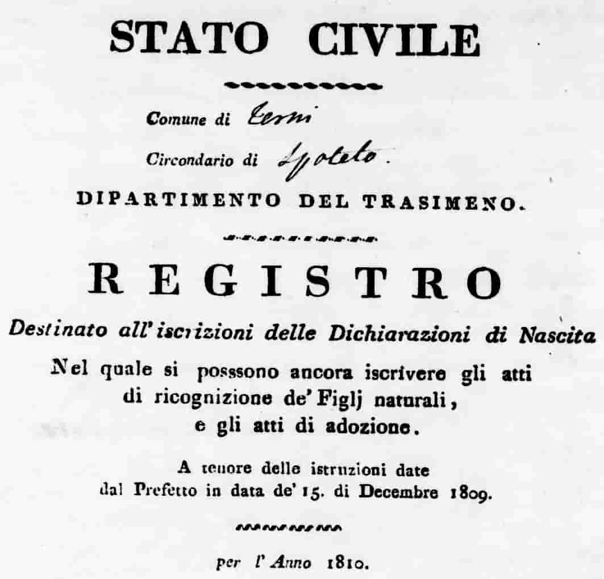
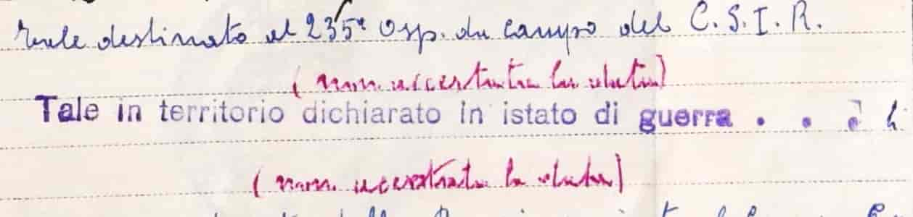

# Genealogical Research in Umbria

## Why this page?

Some of the best work on Italian genealogy has been done by Italian Americans. Many of them have southern roots, and it is only natural that their guides, tips, and strategies lean toward the regions their families came from. That material is often excellent—*for those regions.* But once you begin tracing family history in Umbria, it becomes obvious that much of it does not apply.

Guides that present themselves as “comprehensive” tend to smooth out the local variations. They offer advice that works in Calabria, Campania, or Sicily, and then quietly imply it works everywhere else too. It doesn’t. Umbria has its own administrative history, its own archival quirks, and its own traps. Follow the wrong model here and you risk spending months on sources that never existed or in institutions that cannot possibly hold what you are looking for.

This project exists for one reason: **to focus on Umbria.**
Not “Italy.” Not even “Central Italy.” Just Umbria—because only by being specific can you avoid the false starts and dead ends that come with generic advice.

---

## Why generic advice fails in Umbria

Well-meaning guides will advise you to consult *processetti* (marriage application records) or the *catasto onciario* (18th-century fiscal cadaster). Both are genuinely useful elsewhere. But in Umbria, **they never existed.**

Other sources will insist that “civil registration began in Italy in 1866.” That is true in a broad national sense - but not for Umbria. The region had been annexed by the Kingdom of Sardinia in September 1860, and within months the *Stato civile carloalbertino* system was applied. From 1861 onwards (and even for some December 1860 births), Umbrian municipalities kept proper civil records.

So if you are searching for an Umbrian birth registered in 1862, you do not need the parish registers or the diocesan archives. You need the Comune.

---

## Parish records: seized, scattered, sometimes spared

Nearly every guide to Italian genealogy will tell you: *for records before 1860, go to diocesan archives.* But in Umbria, that advice needs nuance.

After annexation, commissioner Gioacchino Pepoli ordered the seizure of parish registers. In some parishes, **all books were taken.** In others, only those covering people still living (e.g., late 18th century forward). And in certain places - Marsciano is a clear example - **the registers never left the parish at all.**

This means that:

* In some towns, the diocesan archive is indeed indispensable.
* In others, you will find nothing there - because the registers are locked in a Comune, or a state archive, or are gone altogether.
* In yet others, you will need to walk into the parish office itself.

The result: there is **no one-size-fits-all strategy.** The researcher in Umbria must be flexible, pragmatic, and willing to explore more than one institutional path.

---

## Civil records before 1861: the French interlude

Does this mean no civil registration exists before 1861? Not entirely. Between 1809 and 1814, Umbria was part of the French Empire. In that period, **French-style civil registers were kept.**

The problem: they are **fragmentary and poorly documented.** In some places they survive almost complete; in others, they have vanished. And even where they exist, they are often less accessible than older parish books.

Still, if your ancestor was born, married, or died in Umbria during the Napoleonic years, you may strike gold - if you know where to look.

---

## Borders, provinces, and shifting archives

Umbrian genealogy is complicated further by shifting borders. Minor adjustments occurred repeatedly, but some were significant. The province of Rieti, for instance, was once administered as part of Umbria, though today it belongs to Lazio. These changes can make record-finding a puzzle: the archive that “should” hold the book you need may never have received it - or may have lost it during administrative reshuffling.

---

## The brogliardi: cadastral registers, but with limits

Another source often overlooked in general guides are the **brogliardi** of the *Catasto Gregoriano*. These were the written registers created alongside the cadastral maps of the early 19th century, listing parcels, owners, and uses.

For Umbrian research, they can be invaluable—but with limits. What survives and what has been digitized varies greatly. The [Archivio di Stato di Roma’s portal](https://imagoarchiviodistatoroma.cultura.gov.it/Gregoriano/brogliardi.php) provides online access, but **only for the immediate town center of a municipality.** The surrounding *frazioni*, suburbs, and countryside do exist in the original records, but they have **not yet been digitized.**

Another caveat: the brogliardi do not list everyone. They record only **property owners (*possidenti*)**, not tenants, farmhands, or household members. In practice, this means the online brogliardi are a starting point, not the whole picture. If your family lived outside the town proper—or if they did not own land—you will need to consult the undigitized registers preserved in the archives, or turn to other sources entirely.

---

## The state archives

Umbria has two state archives: **[Perugia](http://www.archiviodistatoperugia.it)** and **[Terni](https://antenati.cultura.gov.it/)**, with subsidiary sections at **Gubbio, Spoleto, Assisi, and Orvieto.** One might assume that these institutions hold exhaustive civil registers, digitized and ready for consultation.

Unfortunately, the reality is more modest. Compared to other Italian regions, the Umbrian state archives contain **less in terms of civil records,** and Perugia in particular has digitized very little of what it does hold.

Researchers must often rely on on-site visits, requests by email, or indirect paths (e.g., through municipal offices). The archives remain vital, but they cannot serve as the single, centralized resource one might hope for.

---

## Access to Civil Records

Access to Italian civil registers is strictly regulated. Even though the records are technically public, individuals **cannot consult the registers directly**. Instead, the local *ufficiale di stato civile* (civil registrar) is the sole custodian and the only one allowed to issue extracts, certificates, or conduct searches in response to requests. Anyone requesting these documents must demonstrate a personal and legitimate interest.

An important exception applies once 70 years have passed from the creation of an act. After this period, copies can be released without the requester needing to prove a personal interest. However, even in this case, direct browsing of registers remains prohibited: the official must still carry out the search and issue the extracts. Moreover, if an old act contains annotations or corrections added within the last 70 years, those newer details are still protected and must be omitted in the copies.

**Source:** *Ministero dell’Interno – [Massimario per l’ufficiale di stato civile](https://old.asgi.it/public/parser_download/save/ministero.dell.interno.massimario.per.l.ufficiale.dello.stato.civile.pdf)*

---

## Table of Contents

This resource is organized to reflect the actual institutions and jurisdictions relevant to Umbrian genealogy. The aim is to make it easy to move from the **modern municipality** to the **records** (civil, ecclesiastical, military) that might apply.

* **[Municipalities of Umbria](muni_list.md)**
  Each of the 92 municipalities has its own page. These include:

  * List of **frazioni** and parishes.
  * Notes on **former municipalities** absorbed into the present territory.
  * Contact details for the **Ufficio di Stato Civile** (where civil records are kept today).
  * A summary of known **holdings** (if catalogs or inventories are available).
  * Any **specific notes**—gaps, seizures, or peculiar archival situations.

* **[Dioceses of Umbria](dioceses.md)**
  A section on the diocesan archives. In Umbria, most parish registers were transferred to the municipalities together with the civil status registers and are kept there today. However, some dioceses still retain parts of these records, and in rare cases the diocesan archive holds the entire set for a municipality.

* **[Tribunali](tribunali.md)**
  A section on the courts active in Umbria during the relevant periods. All courts held copies of civil records. This section will map their jurisdictions and survival of documentation.

* **[Military Subdivisions](military_divs.md)**
  A section covering the military districts that included Umbrian territory, with attention to where **ruoli matricolari** (military draft registers) and related series were kept or are now preserved.
