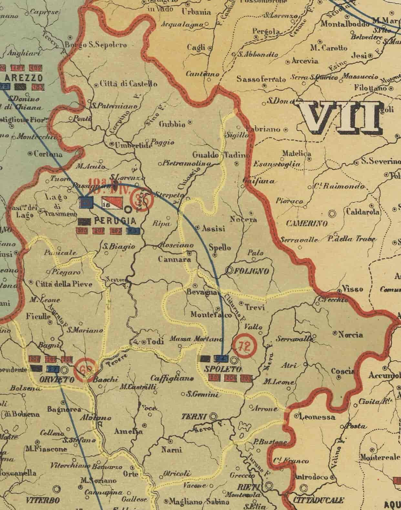
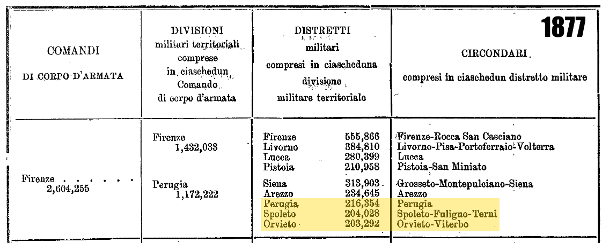
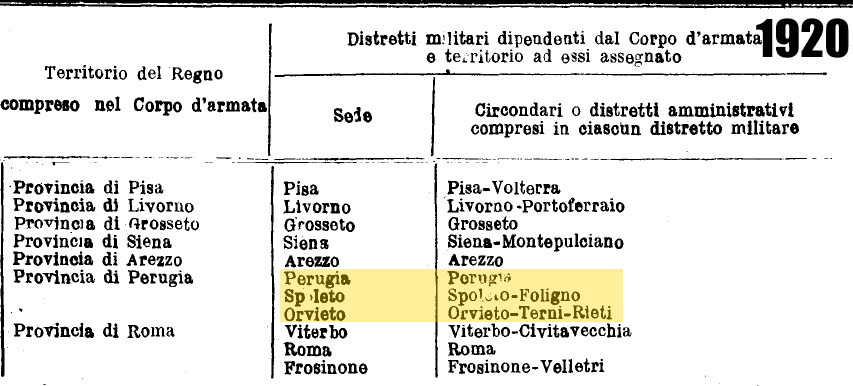

# Military Districts Relevant to Umbria

The *distretto militare* (military district) was the Italian state’s local military subdivision, primarily responsible for conscription, recruitment, and maintaining *ruoli matricolari* (enlistment registers). 

These records are essential for genealogical research as they contain detailed information on men subject to military service.

---

## Distretto militare di Perugia

* **Archival reference:** [SAN catalog entry](http://san.beniculturali.it/web/san/dettaglio-complesso-documentario?step=dettaglio&codiSanCompl=san.cat.complArch.96259&id=96259)
* **Repository:** Archivio di Stato di Perugia
* **Chronology:** 1848–1950
* **Extent of records:** 2,477 units

**Notes on extension:**

* Established in **1870** when military districts were created.
* Originally covered the whole of Umbria.
* From **1877**, restricted to the [circondario di Perugia](https://it.wikipedia.org/wiki/Circondario_di_Perugia).

---

## Distretto militare di Spoleto

* **Archival reference:** [SAN catalog entry](http://san.beniculturali.it/web/san/dettaglio-complesso-documentario?step=dettaglio&codiSanCompl=san.cat.complArch.46377&id=46377)
* **Repository:** Archivio di Stato di Perugia – Sezione di Spoleto
* **Chronology:** Classes 1843–1903
* **Extent of records:** 282 registers + 36 rubrics

**Notes on extension:**

* Established in **1877**.
* Covered the [circondario di Spoleto](https://it.wikipedia.org/wiki/Circondario_di_Spoleto), [circondario di Foligno](https://it.wikipedia.org/wiki/Circondario_di_Foligno), and [circondario di Terni](https://it.wikipedia.org/wiki/Circondario_di_Terni).
* In **1920**, it lost the *circondario di Terni*, which was reassigned to Orvieto.

⚠️ The **Archivio di Stato di Perugia** confirms that the paper indexes of draft records (*fogli matricolari*) for the districts of Perugia and Spoleto have been digitized ([source](http://www.archiviodistatoperugia.it/sites/default/files/istruzioni_opendams.pdf)), proving the records still exist even if not online.

---

## Distretto militare di Orvieto

* **Archival reference:** [SIAS catalog entry](https://sias-archivi.cultura.gov.it/cgi-bin/pagina.pl?TipoPag=comparc&Chiave=479703&RicSez=fondi&RicTipoScheda=ca&RicProgetto=as%2Dterni%2Dorvieto&RicVM=indice)
* **Repository:** Archivio di Stato di Terni (Orvieto section until 1956; later transferred to Viterbo)
* **Chronology:** 1877–1922 (with earlier material dating back to 1836, covering classes of conscripts before the district’s formal creation)
* **Extent of records:** 185 units (166 registers, 19 fascicoli)

**Notes on extension:**

* Established in **1877**.
* Initially covered the [circondario di Orvieto](https://it.wikipedia.org/wiki/Circondario_di_Orvieto) and the [circondario di Viterbo](https://it.wikipedia.org/wiki/Circondario_di_Viterbo) (Lazio).
* In **1920**, it gained the [circondario di Terni](https://it.wikipedia.org/wiki/Circondario_di_Terni), after it was detached from Spoleto.

* Indices of **military draft rolls (ruoli matricolari)** for the district of Orvieto are available online through the *[Archivio di Stato di Viterbo](https://archiviodistatoviterbo.cultura.gov.it/patrimonio-documentario/inventari-on-line-1)*. These include:

  * *Ruoli matricolari Orvieto. Parte prima* (1876–1912)
  * *Ruoli matricolari Orvieto. Parte seconda* (1913–1937)
  * *Ruoli matricolari Viterbo-Orvieto* (1850–1915)

## Summary Tables for Territorial Changes

---

## Bonus Military Sources

* [Atti mortuari di soldati negli eserciti napoleonici che per nascita appartennero al dipartimento del Trasimeno (1808–1814)](https://antenati.cultura.gov.it/ark:/12657/an_ua37808965/Lqy7W1q) – death records for men born in the Trasimeno department who died while serving in the Napoleonic armies.
