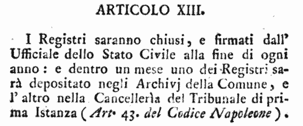
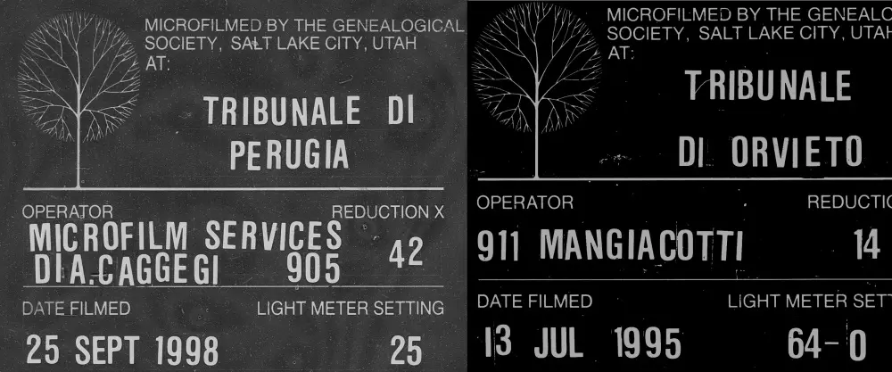

# Tribunali (Courts)

Civil registration in Italy was always tied to the courts because registers were produced in duplicate:
one copy remained in the municipality, while the other was deposited at the territorial court.

* **Napoleonic civil status (1810–1814).**
  With annexation to the French Empire, municipalities in Umbria began keeping registers of births, marriages, and deaths from 1810. These were compiled in duplicate, with one copy sent to the *tribunale territoriale*. This system ended in 1813 (or more seldom in 1814).
  

* **Italian civil status (1866–).**
  From 1866 onward, registers of the Kingdom of Italy (birth, marriage, death, and citizenship) were likewise created in duplicate: one copy remained in the *comune*, while the other was sent to the competent *tribunale*. This makes courts critical for genealogical research, since in principle they hold a complete second series of civil registers.
  
  Source: *[Ricerche genealogiche](https://sab-piemonte.beniculturali.it/ricerche-on-line/ricerche-genealogiche)* - Soprintendenza Archivistica e Bibliografica del Piemonte e della Valle d'Aosta
  
FamilySearch’s holdings for Umbria reflect this arrangement: the vast majority of registers were filmed not in the municipalities, but from the copies deposited in the courts, which is why catalog entries often appear under the name of the relevant *tribunale*.

  
---

## Tribunale di Perugia

* **Existence:** Active from 1860 onward (still in operation).
* **Jurisdiction:** Seat of the tribunal for Perugia and subordinate municipalities. Covered all municipalities in the district.
* **Holdings:** The State Archives of Perugia preserve the duplicate civil registers deposited here — a very large series of **12,610 units** covering the years 1861–1899.

Source: [SAN catalog entry](http://www.san.beniculturali.it/web/san/dettaglio-complesso-documentario?step=dettaglio&codiSanCompl=san.cat.complArch.96907&idSogc=&id=96907)

⚠️ The **State Archives of Perugia** maintains an internal Excel inventory of all *stato civile* registers for the province’s municipalities, confirming their survival and availability, even if they are not made available online ([source](http://www.archiviodistatoperugia.it/sites/default/files/istruzioni_opendams.pdf)).

---

## Tribunale di Orvieto

* **Existence:** 1860–2012 (suppressed 1923–1944; re-established 1944; suppressed again 2012).
* **Jurisdiction:** Initially composed of the *Preture* of Orvieto, Ficulle, and Città della Pieve.
* **Changes:**

  * Suppressed in 1923; jurisdiction transferred to the newly created Tribunal of Terni.
  * Reconstituted in 1944 and active until 2012, when it was permanently suppressed and merged into Terni.

  Source: [SIAS entry](https://sias-archivi.cultura.gov.it/cgi-bin/pagina.pl?TipoPag=prodente&Chiave=92344)

---

## Tribunale di Terni

* **Existence:** 1923–present.
* **Jurisdiction at founding (1923):** Took over from the suppressed tribunals of Rieti, Orvieto, and Spoleto. Covered Acquasparta, Arrone, Cesi, Collescipoli, Collestatte, Ferentillo, Montecastrilli, Montefranco, Papigno, Piediluco, Polino, San Gemini, Stroncone, Terni, Torre Orsina.
* **Archival note:** A major deposit was transferred to the *Archivio di Stato di Terni* in 1982, including **400 registers of civil status (1860–1915)** covering: \
Terni, Acquasparta, Alviano, Amelia, Arrone, Attigliano, Calvi, Capitone, Castel di Lago, Ceselli, Cesi, Collescipoli, Collestatte, Ferentillo, Giove, Guardea, Lugnano in Teverina, Montefranco, Papigno, Penna in Teverina, Piediluco, Polino, Porchiano, Portaria, San Gemini, Stroncone, Torre Orsina.

Sources:

* [SIAS – Tribunale di Terni (institutional entry)](https://sias-archivi.cultura.gov.it/cgi-bin/pagina.pl?TipoPag=prodente&Chiave=90827)
* [SIAS – Tribunale civile e penale di Terni (archival holdings)](https://sias-archivi.cultura.gov.it/cgi-bin/pagina.pl?TipoPag=comparc&Chiave=512675&RicProgetto=as%2dterni)

---

## Tribunale di Spoleto

* **Existence:** 1860–present (inactive 1923–1941).
* **Jurisdiction:**

  * Before suppression in 1923, included Spoleto and surrounding municipalities.
  * Re-established in 1941 with jurisdiction over Campello sul Clitunno, Cascia, Castel Ritaldi, Cerreto di Spoleto, Giano dell’Umbria, Gualdo Cattaneo, Montefalco, Monteleone di Spoleto, Norcia, Poggiodomo, Preci, Sant’Anatolia di Narco, Scheggino, Spoleto, Trevi, Vallo di Nera.
* **Changes:** Suppressed in 1923, reactivated in 1941; continues today as *Tribunale ordinario di Spoleto*.

* **French civil records:** The State Archives of Spoleto list 352 registries of Napoleonic *stato civile* (1810–1813; births 104, marriages 144, deaths 104). 
  * These cover localities in the cantons of Cascia, Norcia, Spoleto, Terni, as well as Arquata del Tronto and Visso in the Marche region ([SAN](http://dati.san.beniculturali.it/SAN/complarc_GGASI_san.cat.complArch.46311); [MAAS](http://www.maas.ccr.it/PDF/Perugia.pdf)).

Source: [SIAS entry](https://sias-archivi.cultura.gov.it/cgi-bin/pagina.pl?TipoPag=prodente&Chiave=90826)

---

## Further Information

### Court jurisdiction territories

* **1892:** As listed in [Bollettino ufficiale del Ministero di grazia e giustizia e dei culti](https://www.google.it/books/edition/Bollettino_ufficiale_del_Ministero_di_gr/kRXd4t5fK-0C?hl=en&gbpv=1&pg=PA457&printsec=frontcover)
* **1989:** As listed in the [Gazzetta ufficiale della Repubblica italiana](https://www.google.it/books/edition/Gazzetta_ufficiale_della_Repubblica_ital/-Z6nogg-qMQC?hl=en&gbpv=1&pg=RA8-PA38&printsec=frontcover)
